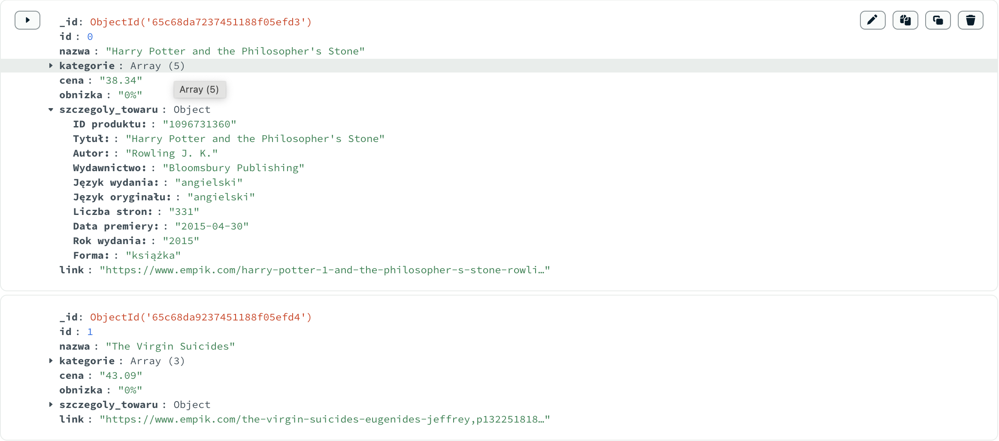

## Ruby crawler
### This project represents Ruby web crawler with usage of Nokogiri library

> *NOTE*
>
> Crawler will scrap only 10 products due to CAPTCHA. It also uses Watir webdriver, because sub-pages containing
> product specific information is mostly JavaScript dependent. Webdriver is not set to headless mode due to specific 
> website (`www.empik.com`) pop-ups on entrance.
> [It can be set with: `Watir::Browser.new :headles=true`]

TODO
- [x] Należy pobrać podstawowe dane o produktach (tytuł, cena), dowolna kategoria
- [x] Należy pobrać podstawowe dane o produktach wg słów kluczowych
- [x] Należy rozszerzyć dane o produktach o dane szczegółowe widoczne tylko na podstronie o produkcie 
- [x] Należy zapisać linki do produktów
- [x] Dane należy zapisać w bazie danych np. SQLite via Sequel

>Data is saved in mongoDb, entries look like:

>Raw data format, that could be printed to output:
[output](examples/output.txt)

>Single entry in JSON format:
[json](examples/single_entry.json)